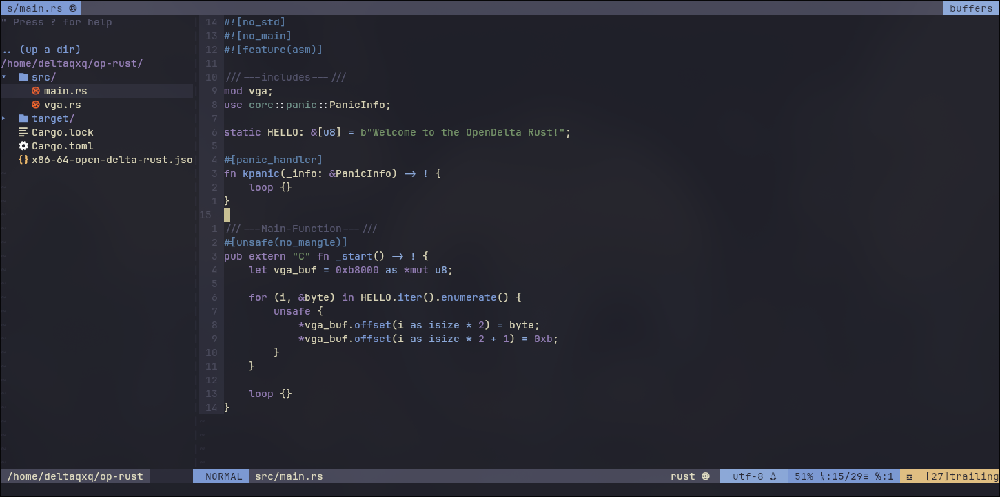

# Kanagawa.vim
### Цветовая тема Kanagawa для реактора Vim.
### Она как https://github.com/menisadi/kanagawa.vim, но она лучше и с поддержкой airline/lightline тем.
-------------------------

## Установка.
### Я пробовал только vim-plug, но возможно работают и остальные.
#### vim-pluig: 
``` vim
call plug#begin('~/.vim/plugged')
    Plug 'deltadev-rsc/Kanagawa.vim'
call plug#end()
```
#### для остальных плагин менеджеров думаю вы знаете как ставить плагины.
----------------------------------------------

### Скриншотик.



-------------------------

## Ссылки разные:
[Github](https://github.com/Delta-Foundation)
[TG](https://t.me/open_delta_project)
